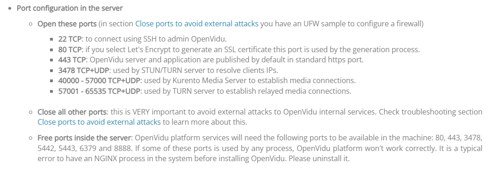
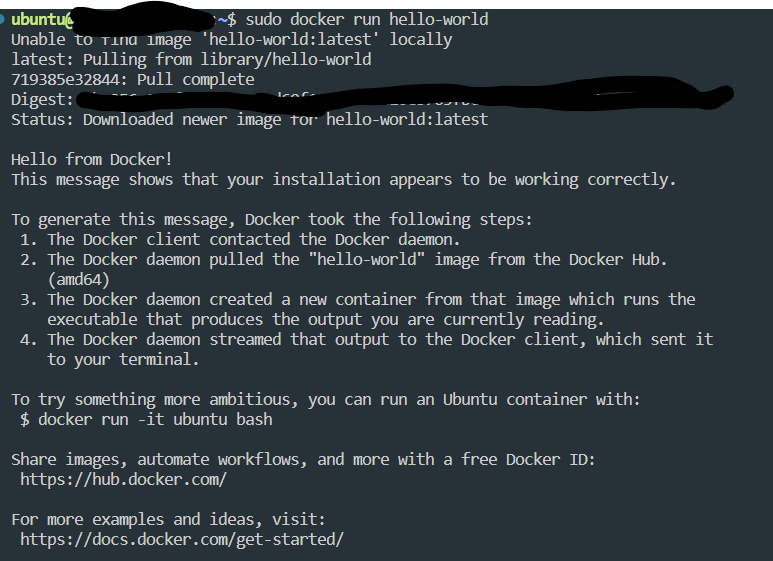

## 개요

앞서 글에서 설명한 것처럼 SSAFY 2학기에 접어들면서 저 포함 6명의
팀원이 함께 공통프로젝트를 진행하게 되었습니다.

공통프로젝트는 WebRTC를 이용한 프로젝트를 진행하게 되는데 제 개인  
클라우드 서버(오라클)과 SSAFY에서 지급한 EC2(AWS)에 WebRTC를  
간편하게 사용할 수 있게 해주는 openvidu 서버를 구축해보면서  
경험한 여러 삽질과 제가 이해한 내용에 대해 정리해보려 합니다.

[앞선 글](https://bnk159hair.github.io/Tips/SSAFY/openvidu-series/openvidu-intro/#webrtcweb-real-time-communication%EB%9E%80)을 읽고 이해하시면 아래 내용을 수행하는데 도움이 될거 같습니다.

<br/>
<br/>

## 목차

- 구축하고자 하는 환경 설명
- 설치 전 주의할 점
- 도커 설치
- 포트 개봉
- Deployment 설치
- 파일 설정
- 실행시키기
- NGINX 설정 변경

<br/>
<br/>

## 구축하고자 하는 환경 설명

openvidu를 통해 화상 기능을 제공하는 것이 저희 프로젝트의 가장 핵심 포인트였기에, 로컬에서 openvidu 도커 이미지를 돌리며 개발하는 것이 아닌 백엔드 팀원이 바로 실제 서버에 배포시키고, 프론트엔드는 해당 서버에 접속하며 개발을 할 수 있는 환경을 구축하고 싶었습니다.

대략적인 구상도를 그리면 아래와 같습니다.


<br/>
<br/>

## 설치 전 주의할 점



- openvidu가 사용하는 포트는 위와 같습니다. 그런데 다른 프로세스들이 해당 포트를 사용하고 있으면 openvidu는 정상적으로 작동하지 않습니다.
- 그래서 가장 좋은건 다른 무엇보다 먼저 openvidu를 설치하는 것입니다.
  저는 [해당글](https://velog.io/@kwak0568/OpenVidu-%EB%B0%B0%ED%8F%AC-Port%EC%99%80%EC%9D%98-%EC%A0%84%EC%9F%81)을 보고 서버를 받자마자 openvidu deployment를 설치했습니다.
- openvidu deployment에 커스텀된 NGINX도 포함되니 가급적 openvidu deployment 먼저 설치하시는걸 추천합니다.

<br/>
<br/>

## 도커 설치

openvidu deployment를 설치하기 위해서는 도커가 설치되어 있어야 합니다.  
가장 좋은건 [공식문서](https://docs.docker.com/engine/install/#server)를 보고 설치하는 것이지만 아래에도 적어 놓겠습니다. 서버의 OS가 Ubuntu 20.04이기에 아래 과정은 Ubuntu 20.04 기준입니다.

<br/>

### 구버전 지우기

EC2를 새로 발급받은 상태면 필요없을 수 있지만 혹시 모르니 진행합니다.  
지워야할 패키지는 다음과 같습니다.

- docker.io
- docker-compose
- docker-doc
- podman-docker

```
for pkg in docker.io docker-doc docker-compose podman-docker containerd runc; do sudo apt-get remove $pkg; done
```

<br/>

### apt repository를 통해 설치

설치 방법도 4가지 정도 있지만 제기준 가장 편한 apt repository를 통해 설치하겠습니다.

<br/>

#### repository 설정

1. apt 패키지 인덱스를 업데이트 하고 https로 repository를 이용할 수 있게 apt에 패키지를 설치합니다.

```
sudo apt-get update
sudo apt-get install ca-certificates curl gnupg
```

2. 도커의 official GPG key를 추가합니다.

```
sudo install -m 0755 -d /etc/apt/keyrings
curl -fsSL https://download.docker.com/linux/ubuntu/gpg | sudo gpg --dearmor -o /etc/apt/keyrings/docker.gpg
sudo chmod a+r /etc/apt/keyrings/docker.gpg
```

3. 아래 명령어를 통해 repository를 설정합니다.

```
echo \
  "deb [arch="$(dpkg --print-architecture)" signed-by=/etc/apt/keyrings/docker.gpg] https://download.docker.com/linux/ubuntu \
  "$(. /etc/os-release && echo "$VERSION_CODENAME")" stable" | \
  sudo tee /etc/apt/sources.list.d/docker.list > /dev/null
```

4. apt 패키지 인덱스를 update 합니다.

```
sudo apt-get update
```

<br/>

#### 도커 엔진 설치

1. 아래 명령어를 통해 최신 버전의 도커 엔진, containerd, 도커 컴포즈를 설치합니다.

```
sudo apt-get install docker-ce docker-ce-cli containerd.io docker-buildx-plugin docker-compose-plugin
```

2. 아래 명령어를 통해 도커 설치가 완료되었는지 확인합니다.

```
sudo docker run hello-world
```



<br/>
위와 같이 화면이 나온다면 성공적으로 완료된 것입니다.

<br/>
<br/>

## 포트 개방

```
ufw allow ssh
ufw allow 80/tcp
ufw allow 443/tcp
ufw allow 3478/tcp
ufw allow 3478/udp
ufw allow 40000:57000/tcp
ufw allow 40000:57000/udp
ufw allow 57001:65535/tcp
ufw allow 57001:65535/udp
ufw enable
```

<br/>
<br/>

포트 개방 전 ufw가 설치 되어있는지 확인하시기 바랍니다.(제가 받은 EC2는 설치 되어있었습니다.)

## Deployment 설치

1. /opt에 openvidu를 설치하는 것이 권장되기에 root 계정으로 전환합니다.

```
sudo su
```

2. 디렉토리 변경

```
cd /opt
```

3. openvidu deployment 다운로드

```
curl https://s3-eu-west-1.amazonaws.com/aws.openvidu.io/install_openvidu_latest.sh | bash
```

4. 성공적으로 openvidu 폴더가 다운로드 되면 아래와 같은 화면이 나옵니다.

```
=======================================
Openvidu Platform successfully installed.
=======================================

1. Go to openvidu folder:
$ cd openvidu

2. Configure DOMAIN_OR_PUBLIC_IP and OPENVIDU_SECRET in .env file:
$ nano .env

3. Start OpenVidu
$ ./openvidu start

For more information, check:
https://docs.openvidu.io/en/stable/deployment/ce/on-premises/
```

<br/>
<br/>

## 파일 설정

```
# OpenVidu configuration
# ----------------------
# Documentation: https://docs.openvidu.io/en/stable/reference-docs/openvidu-config/

# NOTE: This file doesn't need to quote assignment values, like most shells do.
# All values are stored as-is, even if they contain spaces, so don't quote them.

# Domain name. If you do not have one, the public IP of the machine.
# For example: 198.51.100.1, or openvidu.example.com
DOMAIN_OR_PUBLIC_IP=

# OpenVidu SECRET used for apps to connect to OpenVidu server and users to access to OpenVidu Dashboard
OPENVIDU_SECRET=

# Certificate type:
# - selfsigned:  Self signed certificate. Not recommended for production use.
#                Users will see an ERROR when connected to web page.
# - owncert:     Valid certificate purchased in a Internet services company.
#                Please put the certificates files inside folder ./owncert
#                with names certificate.key and certificate.cert
# - letsencrypt: Generate a new certificate using letsencrypt. Please set the
#                required contact email for Let's Encrypt in LETSENCRYPT_EMAIL
#                variable.
CERTIFICATE_TYPE=selfsigned

# If CERTIFICATE_TYPE=letsencrypt, you need to configure a valid email for notifications
LETSENCRYPT_EMAIL=user@example.com
...
```

`.env` 파일을 수정해서 openvidu 환경설정을 마무리 해야합니다.

1. `DOMAIN_OR_PUBLIC_IP`과 `OPENVIDU_SECRET` 값을 변경해주세요. 값이 비어있으면 작동이 안됩니다.
2. `CERTIFICATE_TYPE`을 변경해야합니다. 기본값은 selfsigned일텐데 저희는 외부(프론트엔드)에서 접속을 할 것이기에 자동으로 인증서를 발급해주는 letsencrypt로 변경해주었습니다.  
   메일 주소도 설정해주어야 하는데 실제 존재하는 메일주소를 입력해주세요.  
   원래대로라면 NGINX를 설치하고 certbot을 통해 letsencrypt 인증서를 발급받아야하지만 openvidu deployment에서 위와 같은 작업을 .env 설정 변경을 통해 다 해줍니다. (저는 openvidu가 이러한 작업을 해주는지 모르고 여러 삽질을 했습니다.)

<br/>
<br/>

## 실행시키기

실행은 아래 명령어를 통해 실행시킬 수 있습니다.

```
./openvidu start
```

그러면 아래와 같은 화면이 나오게 되고

```
Creating openvidu-docker-compose_coturn_1          ... done
Creating openvidu-docker-compose_app_1             ... done
Creating openvidu-docker-compose_kms_1             ... done
Creating openvidu-docker-compose_nginx_1           ... done
Creating openvidu-docker-compose_redis_1           ... done
Creating openvidu-docker-compose_openvidu-server_1 ... done
```

```
----------------------------------------------------

   OpenVidu Platform is ready!
   ---------------------------

   * OpenVidu Server: https://DOMAIN_OR_PUBLIC_IP/

   * OpenVidu Dashboard: https://DOMAIN_OR_PUBLIC_IP/dashboard/

----------------------------------------------------
```

해당 화면이 나오게 된다면 성공적으로 완료된 것입니다.  
start 외에도 stop, restart 같은 명령어를 사용할 수 있습니다.  
./openvidu start를 하게 되면 도커 컴포즈 파일을 실행 시키는 것이기에

```
docker compose up -d
```

로 진행해도 성공적으로 작동하게 됩니다.

<br/>
<br/>

## 내가 개발한 openvidu based application 배포

본인이 개발한 openvidu based application을 배포 하고 싶다면 해당 어플리케이션을 도커 이미지화 한 다음
`docker-compose.override.yml`을 수정해야합니다.

```
version: '3.1'

services:
    app:
        image: your-image-name:X.Y.Z
        restart: on-failure
        network_mode: host
        environment:
            - SERVER_PORT=5442
            - OPENVIDU_URL=http://localhost:5443
            - OPENVIDU_SECRET=${OPENVIDU_SECRET}
```

위의 코드에서 image를 application의 이미지로 수정하면 됩니다.  
기본값은 openvidu가 제공하는 비디오 회의 앱입니다.  
위의 이미지만 수정하면 도메인 주소로 접속시 설정한 어플리케이션이 나타나는 것을 확인할 수 있습니다.

<br/>
<br/>

## NGINX 설정 변경

하지만 저의 경우에는 당장 프론트엔드 배포가 아닌 2개의 백엔드 서버를 올려야 했기에 NGINX 설정을 수정해야 했습니다.  
저와 같은 사람을 위해 openvidu에서 어떻게 해야하는지 알려줍니다.

1. openvidu가 정상적으로 돌아갈 수 있게 .env 파일을 수정한 후 최소 한번 openvidu server를 실행시켜야합니다. 그래야 nginx를 수정할 수 있는 default.conf가 생성 됩니다.
2. nginx가 실행중일 때 아래 명령어를 통해 nginx의 설정 파일을 가져옵니다.

```
sudo su
cd /opt/openvidu
docker-compose exec nginx cat /etc/nginx/conf.d/default.conf > custom-nginx.conf
docker-compose exec nginx cat /etc/nginx/nginx.conf > nginx.conf
```

위 명령어를 실행하면 `/opt/openvidu/custom-nginx.conf`와 `/opt/openvidu/nginx.conf`가 생성됩니다. 3. /opt/openvidu에서 생성된 custon-nginx.conf를 수정하면 됩니다. 4. nginx.conf도 수정할 수 있지만 아래의 코드를 지우면 custon-nginx.conf를 불러올 수 없습니다.

```
include /etc/nginx/conf.d/*.conf;
include /etc/nginx/vhost.d/*.conf;
```

5. 아래 코드를 추가하여 nginx 서비스에 volume을 추가합니다.

```
    nginx:
        ...
        volumes:
            ...
            - ./custom-nginx.conf:/custom-nginx/custom-nginx.conf
            - ./nginx.conf:/etc/nginx/nginx.conf
```

<br/>
추가적인 어플리케이션을 추가하고 싶다면 docker-compose 파일 수정과 nginx 파일 수정을 통해 완료할 수 있습니다.

저의 경우 custom-nginx.conf에 yourapp에 제가 작성한 백엔드 서버를 우선 넣었고, 비즈니스 백엔드 서버도 추가했습니다.

```
# Your App
upstream yourapp {
    server localhost:5442;
}

upstream openviduserver {
    server localhost:5443;
}

upstream backendserver {
    server localhost:8081;
}

upstream jenkinsserver {
    server localhost:10207;
}
...

server {
    listen 443 ssl;
    listen [::]:443 ssl;

...

   location /api/v1 {
        proxy_pass http://backendserver;
    }

```

docker-compose.override.yml은 다음과 같이 수정했구요

```
version: '3.1'

services:
    # --------------------------------------------------------------
    #
    #    Change this if your want use your own application.
    #    It's very important expose your application in port 5442
    #    and use the http protocol.
    #
    #    Default Application
    #
    #    Openvidu-Call Version: 2.28.0
    #
    # --------------------------------------------------------------
    app:
        image: openvidu_api_server
        restart: on-failure
        network_mode: host
        environment:
            - SERVER_PORT=5442
            - OPENVIDU_URL=http://localhost:5443
            - OPENVIDU_SECRET=${OPENVIDU_SECRET}
            - DB_URL=${DB_URL}
            - DB_USER=${DB_USER}
            - DB_PASSWD=${DB_PASSWD}
        logging:
            options:
                max-size: "${DOCKER_LOGS_MAX_SIZE:-100M}"
        volumes:
            - /home/ubuntu/recordings:/var/lib/recordings

    back:
        image: api_server
        restart: on-failure
        network_mode: host
        logging:
            options:
                max-size: "${DOCKER_LOGS_MAX_SIZE:-100M}"

```

<!-- ## 삽질한 부분

또한 제 컴퓨터의 크롬 브라우저는 성공적으로 서버 접속이 되는데, 다른 브라우저와
팀원들의 컴퓨터는 접속할 수 없는 문제가 있었습니다
이 문제는 .env 파일에서 ssl 관련 인증을 letsencrypt로 수정하면서 해결되었습니다.
공식 문서에서 서로 다른 하드웨어에 서비스들을 각각 구축할 경우, 프록시 서버를 통해 통신해야한다고 이야기 했지만
제 크롬 브라우저에서는 성공적으로 접속한 점과 openvidu 컨테이너에서 이미 nginx를 사용하는데, 내가 어떻게 건들 수 있나? 라는 생각 때문에 많은 삽질과 시간을 버렸습니다...
우선 제 브라우저가 이상해서 접속이 되었던 것이고, openvidu deployment에서 nginx 컨테이너도 포함되어있기에 .env파일을 수정하는 것만으로 ssl 인증서 발급과 https 프록시 서버까지 해결해줍니다.
편하게 사용하시면 됩니다.

기본적으로 ./openvidu start 명령어는 docker compose 명령어를 실행하는 것이기에
docker에 대해서 잘 모르시는 분들은 공부를 해보시고 구축하시면 도움이 많이 될것입니다.

처음 글을 작성할 때는 대단한 것을 발견한 것처럼 썼는데 docker compose가 어떻게 구성되는지 알고 나서는
너무 당연한 내용들이네요 -->

## Reference

[openvidu 개념1](https://velog.io/@ohsg97/openVidu-tutorial-%EC%8B%9C%EC%9E%91%ED%95%98%EA%B8%B0)  
[openvidu 개념2](https://2jinishappy.tistory.com/335)  
[openvidu 공식 문서-자바 어플리케이션 서버](https://docs.openvidu.io/en/stable/application-server/openvidu-basic-java/)  
[openvidu 공식 문서-온프레미스로 배포하기](https://docs.openvidu.io/en/stable/deployment/ce/on-premises/)  
[openvidu 공식 문서-openvidu 어플리케이션 배포관련](https://docs.openvidu.io/en/stable/deployment/deploying-openvidu-apps/#with-docker)  
[openvidu 공식 문서-openvidu 리액트 클라이언트 예제](https://docs.openvidu.io/en/stable/tutorials/openvidu-react/)  
[openvidu nginx 설정 변경](https://docs.openvidu.io/en/2.28.0/troubleshooting/#162-modify-openvidu-nginx-configuration)
[openvidu 배포 관련 게시글](https://hoonti06.gitlab.io/wiki/deploying-openvidu-on-premises/#openvidu%EB%A5%BC-%EC%82%AC%EC%9A%A9%ED%95%98%EB%8A%94-application%EC%9D%84-openvidu%EA%B0%80-%EB%B0%B0%ED%8F%AC%EB%90%98%EB%8A%94-%EC%84%9C%EB%B2%84%EC%97%90-%EA%B0%99%EC%9D%B4-%EB%B0%B0%ED%8F%AC%ED%95%98%EB%8A%94-%EB%B0%A9%EB%B2%95)
[싸피 선배님의 조언-포트관련](https://velog.io/@kwak0568/OpenVidu-%EB%B0%B0%ED%8F%AC-Port%EC%99%80%EC%9D%98-%EC%A0%84%EC%9F%81)

```toc

```
