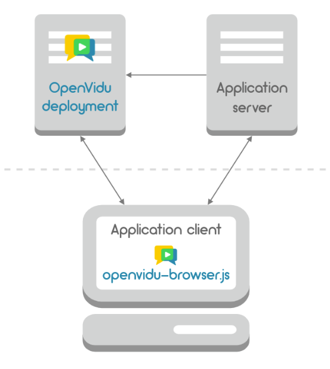

## 개요

SSAFY 2학기에 접어들면서 저 포함 6명의
팀원이 함께 공통프로젝트를 진행하게 되었습니다.

원래는 openvidu를 온프레미스로 구축한 경험글 하나로 퉁쳐서  
작성하려 했는데 생각보다 내용이 많아서 따로 정리하게 됩니다.
<br/>
<br/>

## WebRTC(Web Real-Time Communication)란

- 웹 브라우저가 서로 통신할 수 있도록 설계된 API
- 별도의 플러그인이나 소프트웨어 없이 실시간으로 데이터(음성, 영상, 텍스트, 파일)를 서버(중계자) 없이 브라우저 간에 교환할 수 있도록 하는 기술
- WebRTC 기술은 **P2P(Peer-to-Peer)** 통신에 최적화
- 브라우저끼리 P2P 통신을 사용하기에 별도의 서버가 필요 없어 보이지만, 다음과 같은 서버들을 필요로한다.

  1. 시그널링(Signaling)이라 불리는, 클라이언트들의 통신을 조정하기 위한 메타데이터의 교환 서버
  2. NAT 환경 및 방화벽 대응을 위한 서버(STUN / TURN Server)

<br/>


<br/>

### Signaling / Server

<br/>

- 서로 다른 네트워크 환경에 있는 두 개의 peer간에 통신을 위해서는 서로 상대방의 정보(위치 및 포맷)을 먼저 파악할 필요가 있음
- RTCPeerConnection들이 적절하게 데이터를 교환할 수 있게 처리해주는 과정
- 이를 수행하는 서버 = **시그널 서버**
- 전이중 통신을 지원하는 **websocket**으로 이를 구현하는 것이 가장 적합
- `세션제어메세지`, `네트워크 구성`, `미디어 기능` 정보 교환
- 시그널링은 P2P 스트리밍 시작 전에 성공적으로 완료되어야 함
  - **세션 제어 메세지** : 통신을 초기화하거나 닫고 오류를 보고
  - **네트워크 구성** : 외부세계에 컴퓨터의 ip주소와 포트가 무엇인지 파악
  - **미디어 기능** : 브라우저와 통신하려는 브라우저에서 처리할 수 있는 코덱과 해상도를 파악
- 서버는 단지 웹 브라우저를 특정하기 위한 **시그널링 과정으로만 쓰임**
- 시그널링을 마친 뒤 실제 데이터는 P2P 혹은 중개 서버를 통해 주고 받음
- 서버에서는 websocket(TCP) 사용 (WebRTC는 UDP)
- 크게 SDP(Session Description Protocol)과 ICE(Interactive Connectivity Establishment) Candidate들을 주고받음

```
- SDP 형식에는 미디어를 전송하기 위한 설정값(해상도, 포맷, 코덱 등)이 포함되어 있다.
- ICE는 peer간을 연결할 수 있게 하도록 최적 경로를 찾아주는 프레임워크이며,
STUN/TURN 서버르 통해 찾아낸 주소를 Candidate라 한다.
```

<br/>
<br/>

### STUN(Session Traversal Utilities for NAT) Server

- 통상적인 네트워크에서 통신하기 위해서는 Public IP를 필요로 하며, NAT 환경(사설망)에 놓인 클라이언트는 자신의 Public IP를 알지 못한다.
- STUN 서버는 peer 자신의 Public IP를 알려주는 서버

<br/>
<br/>

### TURN(Traversal Using Relays around NAT) Server

- 만약 두 peer가 같은 NAT환경(사설망)에 있거나, 보호 정책이 엄격한 NAT/Router, 방화벽 등의 이유로 P2P 통신이 실패되는 때도 있는데, 이러한 상황에서 사용되는 것이 TURN 서버이다.
- TURN 서버는 Public 망에 존재하므로 각 peer들이 접속할 수 있으며, 각 peer들은 P2P 통신을 하는 것이 아닌 TURN 서버(릴레이 서버 역할)를 경유하여 통신하게 된다.
- 아무래도 직접 통신하지 않고 TURN 서버가 모든 트래픽을 중계하며 통신하기 때문에 오버헤드와 지연이 발생할 수 있어 어쩔 수 없는 경우에만 사용

[더욱 자세하게 설명되어있는 글입니다.](https://velog.io/@yyong3519/WebRTC-%EA%B0%9C%EB%85%90#webrtc-%EC%9A%A9%EC%96%B4-%EC%A0%95%EB%A6%AC)

<br/>
<br/>
<br/>
<br/>

## Openvidu란

- 웹 또는 모바일 애플리케이션에서 화상 통화를 쉽게 추가할 수 있는 오픈소스 플랫폼,
- Kurento기반의 중개 서버를 애플리케이션에 쉽게 추가할 수 있도록 완전한 기술스택을 제공
- Kurento : WebRTC 미디어 서버 역할을 함과 동시에 WebRTC 기술을 이용해 애플리케이션 개발을 돕는 클라이언트 API세트
  - 그룹간의 통신, 녹음, 방송, 시청각 흐름의 라우팅 기술을 지원하고 있다.  
    [쿠렌토에 대한 자세한 내용은 여기를 참조해주세요](https://gh402.tistory.com/43)
- 가장 큰 장점은 모든 하위 수준의 작업들을 추상화 시켜, WebRTC, ICE Candidates, KMS등의 까다로운 기술들을 몰라도 쉽게 사용할 수 있다는 점
- 따라서 WebRTC 미디어 서버를 구현하는 데 소모되는 리소스를 절약해서 빠르게 실시간 통신을 추가할 수 있도록 도와주는 것이 큰 장점이다.

<br/>
<br/>

### Openvidu의 구조

<br/>


<br>
openvidu의 대략적인 구조는 다음과 같습니다.

- Application client
  - Openvidu-browser.js SDK를 사용하여 Openvidu deployment와 통신하고, 세션에 연결, 미디어 스트림 게시 및 구독 등을 관리
  - 사용자와 직접 상호 작용하는 코드이며 openvidu의 프론트엔드 구현체를 사용할 수 있는 부분
- Application server
  - Application client로부터 api 요청을 받아 처리해주고 deployment와 연결해주는 부분
  - Openvidu deployment가 제공하는 REST API를 사용해서 통신함(Java와 Node SDK를 통해 가능하지만 REST 클라이언트에서 직접 REST API를 호출해서 사용도 가능함)
  - 본인이 작성한 백엔드 서버가 담당하는 부분
- Openvidu deployment
  - 실시간 오디오 및 비디오 스트리밍에 필요한 모든 인프라를 제공함
  - 앞서 설명한 Kurento 미디어 서버, turn 서버 등 openvidu가 추상화한 기능들을 제공하는 구현체

<br/>
<br/>

### Openvidu의 기본 개념

<br/>


<br/>

- Session(세션)
  - 세션은 하나의 가상 공간 개념으로써 참여자들끼리는 서로 오디오와 비디오 스트림을 주고 받을 수 있음
  - 오직 같은 세션에 참여한 참여자들끼리만 가능함
- Connection(연결)
  - Connection은 세션의 각 참가자로 표현할 수 있음
  - application server에서 반드시 초기화해야하며 세션에 연결하기 위해서는 토큰이 application client에게 전달되어야 함
  - 이를 통해 허가받지 않은 사람이 세션에 접속할 수 없게 함
  - Connection은 클라이언트가 세션에 연결하게 해주는 "Slot"으로 볼 수 있음
- Token(토큰)
  - 토큰은 참가자들이 세션에 접근할 수 있게 허락해줌
  - 각 참가자들은 세션에 연결하기 위해 토큰을 사용해야 함
  - 토큰은 항상 "Connection 개념"과 묶여(associated)있기에 클라이언트에게 전달할 token을 얻기 위해서는 application server에서 반드시 Connection을 생성해야함
  - 토큰은 Connection의 slot을 차지할 수 있는 Key 역할의 Connection의 속성임
- Stream(스트림)
  - Stream은 세션으로 흐르는 미디어 스트림을 말함
  - 참가자는 Stream을 배포(publish) 수 있으며 같은 세션의 다른 참가자는 그것을 구독(subscribe)할 수 있음

<br/>
<br/>
<br/>

### Openvidu Session의 흐름도

<br/>


<br/>

1. Application server에서 Session을 초기화 함
2. Application server에서 Session에 대한 Connection을 생성함. 이 때 Connection은 Session에 참가자 수 만큼 생성해야함. 각각의 Session은 Session에 단일 접속하게 해주는 Token을 가짐
3. Token을 Application client에게 전달함
4. 각각의 Client는 openvidu-browser.js를 통해 Token으로 Session에 연결함. 이 과정이 성공하면 Session의 참가자로 간주
5. Session이 한번 연결되면 참가자는 openvidu-browser.js를 통해 Stream을 publish할 수 있고 Session내의 모든 참여자는 이것을 subscribe 할 수 있음

[이해가 안되시면 공식 문서를 참조해보시기 바랍니다.](https://docs.openvidu.io/en/stable/developing-your-video-app/)

<br/>
<br/>
<br/>

## Reference

[openvidu 개념1](https://velog.io/@ohsg97/openVidu-tutorial-%EC%8B%9C%EC%9E%91%ED%95%98%EA%B8%B0)  
[openvidu 개념2](https://2jinishappy.tistory.com/335)  
[openvidu 개념3](https://velog.io/@ohjinseo/ReactJS-EC2-OpenVidu-%ED%99%98%EA%B2%BD%EC%97%90%EC%84%9C-%ED%99%94%EC%83%81%ED%9A%8C%EC%9D%98-%EA%B5%AC%ED%98%84%ED%95%B4%EB%B3%B4%EA%B8%B0)

```toc

```
