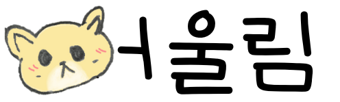
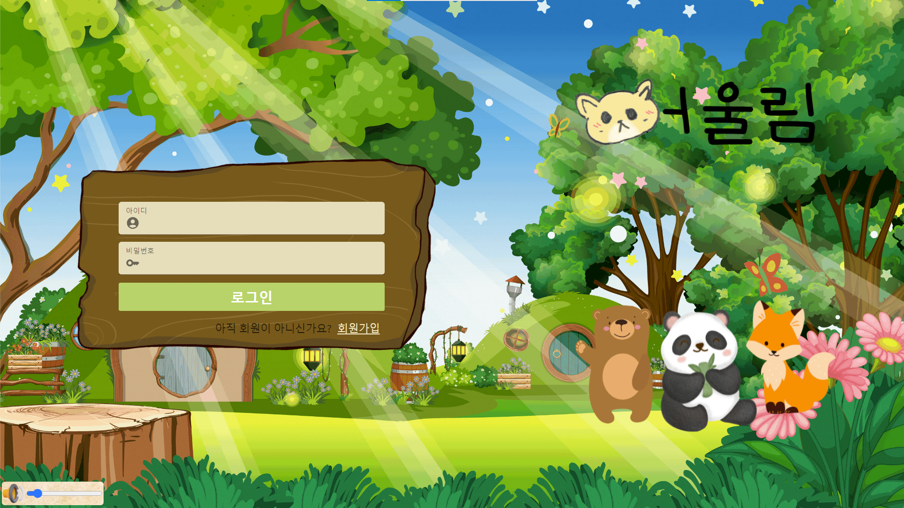

## 📖 개요

**한 줄 소개** : 교외 지역 아이들이 또래 친구를 사귈 수 있는 1:1 랜덤 화상 미팅 서비스  
**진행 기간** : 2023.07.10 ~ 2023.08.18  
**Skills** : Java, SpringBoot, MySQL, JPA, Docker, Jenkins, WebRTC  
**팀 구성** : 백엔드3, 프론트엔드3  
**관련 활동** : SSAFY 9기

**🔗  Links**

Github https://github.com/bnk159hair/Eoullim

<br/>
<br/>

## 📜 서비스 내용

또래 친구를 만나기 힘든 교외 지역 아이들을 대상으로 랜덤 화상 미팅 서비스를 통해 친구를 만나고 사귈 수 있는 서비스입니다.

위 서비스에서 제공하는 핵심 기능은 4가지입니다.

1. 친구 만나기
2. 가이드 기능
3. 동물 가면 기능
4. 녹화 기능

<br/>
<br/>

## 🛠 기술 스택

- Java 11, SpringBoot, JPA
- WebRTC, Openvidu
- MySQL
- Docker, Jenkins, AWS EC2

<br/>
<br/>

## 🖥 개발 내용

### Openvidu를 활용한 WebRTC API 구현

새 친구와 예전에 만났던 친구를 만나기 위해 친구 만나기 기능을 구현하였으며, 부모님의 걱정을 덜어드리기 위해 녹화 기능을 구현했습니다.

브라우저를 통한 화상 미팅 및 녹화 기능을 제공하기 위해, WebRTC를 손쉽게 사용할 수 있게 해주는 오픈소스 프레임워크인 Openvidu를 사용하여 개발했습니다.

<br/>

### Docker를 활용한 배포 서버 및 인프라 구축

하나의 EC2 서버에서 DB 서버와 배포 서버, Openvidu에서 제공하는 STUN/TURN 서버를 안정적으로 구동하기 위해 컨테이너 관리 도구인 Docker를 활용하여 서버를 구동 및 배포하였습니다.

<br/>

### Jenkins를 통한 자동 배포 파이프라인 구축

Jenkins를 활용하여 백엔드, 프론트엔드 어플리케이션을 자동 배포할 수 있는 파이프라인을 구축하였습니다. gitlab과 webhook을 통해 연동하여 gitlab에서 merge가 발생했을 경우 Docker의 multi-stage를 활용한 빌드가 진행되고 서버에 어플리케이션이 자동으로 배포되게 구성하였습니다.

<br/>

### Convention 정립

혼자 개발하는 것이 아닌 함께 공통된 기능을 개발하기 때문에 개발 시작 전 git convention을 정립하였습니다. 추가로 지라와 노션을 활용하여 일정 관리를 진행했고 더욱 효율적인 개발을 수행하였습니다.

<br/>
<br/>

## 💡 성장 경험

### 배포 서버 구축을 통한 인프라 이해도 향상

SSAFY에서 제공하는 AWS EC2에 직접 배포에 필요한 여러 어플리케이션을 작동시키는 업무를 통해 인프라에 대한 이해도를 키울 수 있었습니다.

Docker를 활용하며 Linux의 컨테이너 기술을 손쉽게 활용할 수 있었으며 Docker compose를 통해 다양한 컨테이너를 손쉽게 관리할 수 있었습니다.
<br/>

### 자동 배포를 통한 개발 환경 개선

개발 초기에는 인프라 구축을 담당한 제가 직접 수동으로 어플리케이션 빌드 및 서버에 배포를 진행하였습니다. 그렇기에 팀원들 개개인이 배포 요청을 할 때마다 제 개발을 중단하고 git clone - 빌드 - docker run 하는 과정을 거쳐야 했기에 개발 효율이 떨어지는 문제가 있었습니다.

문제를 해결하기 위해 자동배포 툴인 jenkins에 대해 조사를 한 후 jenkins 파이프라인을 작성하였습니다.

jenkins를 gitlab과 연동함으로써 팀원들이 gitlab에 push 후 develop 브랜치에 merge 하였을 때, clone - 빌드 - docker run 과정을 자동으로 수행하게 하였습니다.

이를 통해 제가 진행하는 개발 업무의 효율을 증가시킬 수 있었습니다.

<br/>

### 실사용자 피드백을 통한 서비스 개선

팀원들과 함께 화상 미팅 서비스의 이점을 잘 활용할 수 있는 대상에 대해 조사하였고 분교와 같은 소외지역의 저학년 아이들이 동갑내기 친구를 만들기 어렵다는 문제점을 확인했습니다.

그래서 저희는 화상 미팅 웹 서비스를 통해 **'소외 지역의 저학년 아이들에게 친구를 만나고 사귈 수 있는 기회를 제공하자'** 는 목표를 세우게 되었습니다.

저희 서비스가 대상으로 하는 사용자는 **저학년의 초등학생**이었기에 아이들의 사용을 도와줄 수 있는 기능들을 팀원들과 함께 기획하는 과정을 거쳤고 해당 내용을 바탕으로 실제 초등학교 교사분들께 설문조사를 통한 피드백을 받았습니다.

하지만 기대했던 긍정적인 반응과 달리, **아이들의 흥미를 유도할 만한 부분들이 부족하고 사용하기 불편할거 같다는 의견**을 받았습니다.
해당 과정을 통해 개발자들이 생각한 사용자의 상황과 실제 사용자들의 상황은 많이 다르다는 것을 알게 되었습니다.

이러한 문제점을 해결하기 위해 팀원들과 함께 아이들과 교사들을 대상으로 **추가적인 설문조사를 진행하였고 기획과 개발을 구체화**해가는 과정을 거쳤습니다.

기획과 개발이 완료된 후 최종 완성본을 **직접 초등학교에 찾아가 시현하는 작업**을 진행하였고
**실제 사용자인 아이들이 즐겁게 사용**하며 상대방과 원할하게 대화하는 모습을 확인할 수 있었습니다.
해당 경험을 통해 단순 추측에서만 나오는 기획에 그치는 것이 아닌, **실제 사용자들과의 피드백을 통한 서비스 기획의 중요**함을 깨달을 수 있었습니다.

<br/>
<br/>

## 👀 서비스 화면

- 로그인 페이지

    

<br/>

- 매칭 페이지

  
<br/>

- 녹화 확인 페이지

  
<br/>

- 실제 초등학교 방문

  

<br/>
<br/>

## 🏆 수상

- 삼성청년SW아카데미 우수상(1등)

```toc

```
