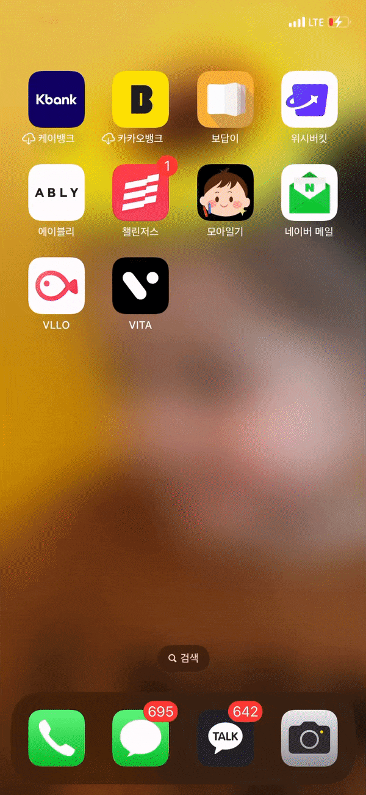
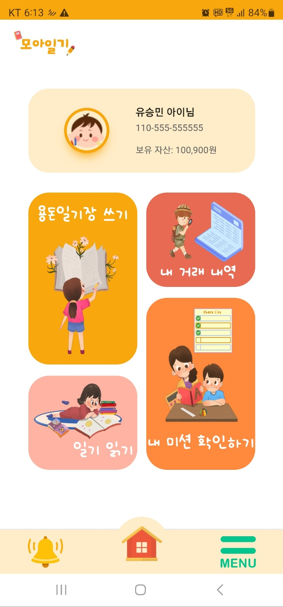
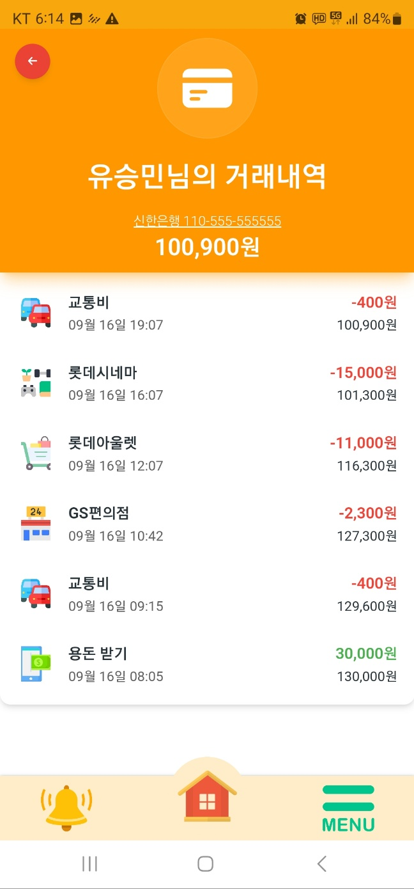
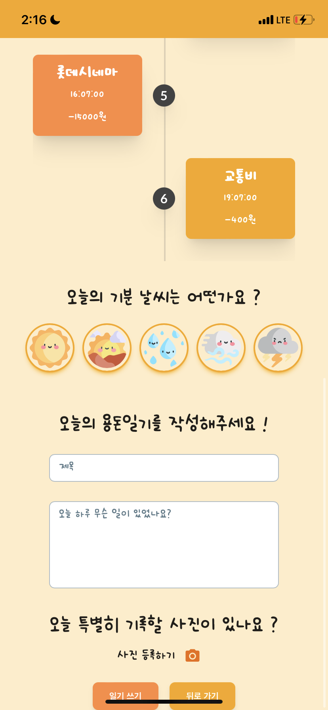

## 📖 개요

**한 줄 소개** : 일기장을 통해 아이들이 손쉽게 용돈 기입을 할 수 있게 해주는 용돈 일기장  
**진행 기간** : 2023.09.01 ~ 2023.09.17  
**Skills** : Java, SpringBoot, MySQL, JPA, QueryDSL, Docker, Jenkins  
**팀 구성** : 백엔드2, 프론트엔드2  
**관련 활동** : 신한 해커톤 with SSAFY

**🔗  Links**

Github https://github.com/Shinhan-Hackathon-IJOAH/IJoah

<br/>
<br/>

## 📜 서비스 내용

아이들에게 어렵게 느껴지는 용돈 기입장 대신 거래내역과 일기장을 융합하여 더욱 손쉽게 아이들의 올바른 소비습관을 기르게 해줄 수 있는 서비스입니다.

위 서비스에서 제공하는 핵심 기능은 3가지입니다.

1. 용돈 일기장
2. 용돈 미션
3. 일기 공유

<br/>
<br/>

## 🛠 기술 스택

- Java 11, SpringBoot, JPA, QueryDSL
- MySQL
- Docker, Jenkins, AWS EC2

<br/>
<br/>

## 🖥 개발 내용

### 백엔드 API 구현

Java, SpringBoot를 활용하여 용돈 일기장의 API와 알림 API, 공유 API, 은행의 비즈니스 로직을 수행하는 API를 개발했습니다.

은행 API의 경우 신한은행에서 제공하는 API 규격을 준수하여 개발하였고 이체, 잔액확인, 1원 본인 인증, 입출금, 거래내역 조회 API를 개발하였습니다.

<br/>

### SSE를 활용한 알림 API 구현

사용자에게 알림 서비스를 실시간으로 제공하기 위해 SSE(Server-Sent-Events) 기술을 활용하였습니다. 부모가 아이를 등록할 때, 입금되었을 때, 용돈 미션과 관련된 이벤트가 발생했을 때 사용자에게 실시간으로 알림이 가게 됩니다.

SSE는 client가 server로부터 데이터만 받을 수 있는 방식이며 별도의 프로토콜을 사용하지 않고 HTTP 프로토콜만으로 사용할 수 있기에 실시간 알림을 구현하는데 있어 용이합니다.

서비스에 접속해있지 않을 경우에는 알림함을 통해 수신한 모든 알림을 읽을 수 있게 구현하였습니다.

<br/>
<br/>

## 💡 성장 경험

### 실제 기업에서 제공하는 API 활용 및 기업이 진행하는 해커톤 참여

신한은행에서 제공하는 API를 활용하였기에 시중 은행이 제공하는 API를 구체적으로 확인하고 개발에 이용할 수 있었습니다.

참가한 4명의 팀원 모두 처음으로 참여하는 해커톤이었는데 현업에서 근무하시는 개발자 분들의 피드백을 받은 경험과 신한은행의 임원 분들에게 우리 서비스를 평가받을 수 있는 좋은 기회였습니다.

<br/>

### 구체적인 업무 분배 및 시간 분배를 통한 효율적인 개발

한 달 전 7주간 진행하는 프로젝트와 신한은행 해커톤에 참여하기 위한 3주짜리 프로젝트를 동시에 진행한 경험이 있습니다.
두 개의 프로젝트가 서로 공통되는 부분이 없어 개발해야 할 업무가 많았기에 시간이 부족한 문제가 있었습니다.

팀장으로서 이를 해결하기 위해 업무를 자세하게 구분하여 우선순위를 매기고 저와 팀원들에게 분배하는 과정을 진행했으며, 매일 두 번의 일정 공유를 통해 개발 이슈를 빠르게 공유함으로써 개발 속도를 높일 수 있었습니다.

이를 통해 기획에서 목표한 기능들을 모두 구현할 수 있었으며 각 프로젝트는 신한은행 해커톤 본선에서 3등과 삼성청년SW아카데미에서 1등을 수상하는 결과를 얻을 수 있었습니다.

<br/>
<br/>

## 👀 서비스 화면

- 랜딩 페이지

    

<br/>

- 메인페이지

  
<br/>

- 거래내역 조회 페이지

  

<br/>

- 일기장 페이지

  
<br/>

- 미션 등록 페이지

  
<br/>
<br/>

## 🏆 수상

- 신한 해커톤 with SSAFY 우수상 (3등)

```toc

```
