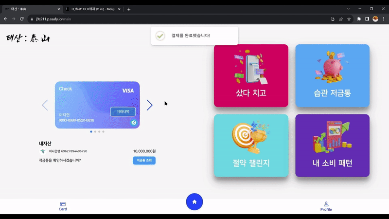
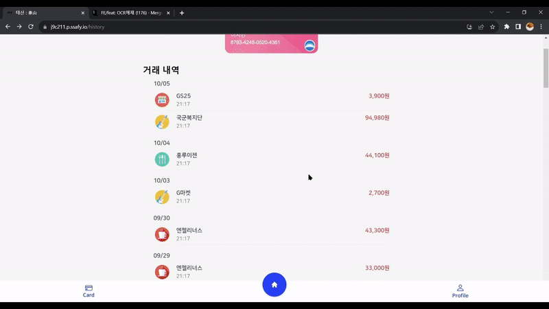
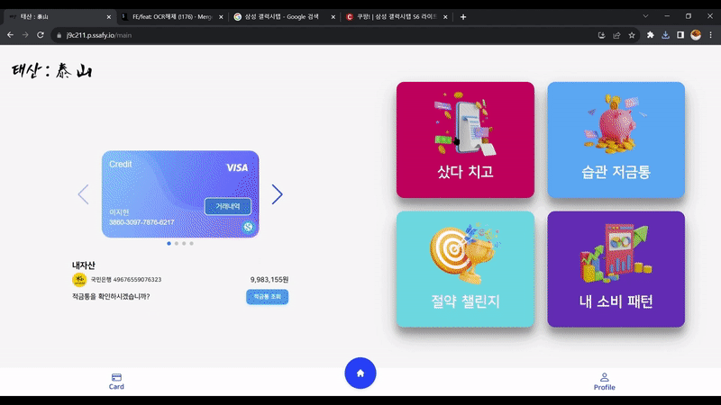

## 📖 개요

**한 줄 소개** : 사용자의 소비 습관을 개선하고 저축 습관을 기를 수 있는 플랫폼  
**진행 기간** : 2023.08.14 ~ 2023.10.06  
**Skills** : Java, SpringBoot, MySQL, JPA, QueryDSL, Python, FastAPI, FastTEXT, CLOVA OCR API, Kakao API  
**팀 구성** : 백엔드3, 프론트엔드3  
**관련 활동** : SSAFY 9기

**🔗  Links**

Github https://github.com/bnk159hair/Taesan

<br/>
<br/>

## 📜 서비스 내용

사용자의 소비습관 관리를 통해 잘못된 소비 습관을 개선하고 소액으로 저축을 진행하여 부담없이 꾸준히 저축할 수 있는 플랫폼입니다.

위 서비스에서 제공하는 핵심 기능은 4가지입니다.

1. 소비 패턴 분석 - 장소, 카테고리 별 소비 패턴을 확인
2. 샀다 치고 - 충동구매를 억제
3. 습관 저금통 - 줄이고 싶은 소비를 관리하며 저축
4. 절약 챌린지 - 지인들과 함께 저축 대결

<br/>
<br/>

## 🛠 기술 스택

- Java 11, SpringBoot, JPA, QueryDSL, Openfeign
- Python, FastAPI, FastTEXT
- MySQL
- CLOVA OCR API, Kakao API

<br/>
<br/>

## 🖥 개발 내용

### CLOVA OCR API를 활용한 영수증 분석 API 개발

저희 서비스의 핵심 기능 중 하나인 영수증 분석 기능을 구현하였습니다. 해당 기능은 사용자가 영수증 사진을 찍으면 OCR을 통해 상품명과 가격을 분석하고 딥러닝 모델을 통해 상품의 카테고리를 분류해줍니다.

CLOVA에서 제공하는 영수증 특화 OCR API를 활용하여 영수증으로부터 상품명과 가격, 수량 데이터를 정확하게 획득할 수 있었습니다.

<br/>

### FastTEXT 딥러닝 모델과 Kakao API를 활용한 상품 카테고리 분류 모델 개발

앞서 영수증 분석 기능에서 상품의 카테고리를 분류하기 위해 개발한 딥러닝 모델입니다. 파이썬에서 제공하는 FastTEXT 사전 학습 모델에 이마트 크롤링 데이터 31개의 카테고리에 대해 310만개의 데이터를 학습 시켰습니다.

이를 통해 91%의 정확도를 끌어올릴 수 있었고 샀다 치고, 습관 저금, 소비 패턴 분석 등 다양한 기능에서 카테고리 분류 모델의 데이터를 활용하였습니다.

<br/>

### FastAPI를 통한 모델 API 개발 및 Openfeign을 통한 API 호출

앞서 개발한 딥러닝 모델을 SpringBoot 백엔드 API 서버와 통신할 수 있도록 FastAPI를 통한 API 서버를 구축하였습니다. 딥러닝 서버의 경우 상품명에 대한 정보 배열을 입력받고 분류 결과를 배열로 반환하는 단순한 API 서버이기에 빠르고 쉽게 구축할 수 있는 FastAPI를 활용했습니다.

또한 SpringBoot 백엔드 API 서버와 딥러닝 API 서버와의 통신을 쉽고 단순하게 구현하기 위해 Openfeign을 사용하여 API를 호출하였습니다.

<br/>
<br/>

## 💡 성장 경험

### 기초 지식을 통한 빠른 개발 기술 습득

학부생 때 시계열분석, 머신러닝 과목을 통해 기계 학습과 심층 학습에 대한 기초 지식 및 모델의 학습 과정 및 특성을 이해할 수 있었습니다.

이를 통해 데이터 수집 - 전처리 - 모델 조사 - 학습 - 성능 개선에 필요한 정보들을 빠르게 학습할 수 있었으며

쇼핑몰 데이터 크롤링 및 전처리, 국내 위키백과 정보가 사전 학습된 FastTEXT 모델에 추가 학습, 딥러닝 API 서버를 구축하는 과정을 통해 저희 태산 서비스의 핵심 기능을 담당하는 카테고리 분류 모델을 개발할 수 있었습니다.

해당 경험을 통해 기초 지식을 통해 새로운 기술을 빠르고 정확하게 습득하여 활용할 수 있는 역량을 키웠습니다.
<br/>

### CLOVA, Kakao API를 응용한 기능 개발 역량

기획 초기에는 영수증을 OCR 해줄 수 있는 모델과 카드 거래내역의 카테고리를 분류할 수 있는 모델도 추가로 개발하기로 했었습니다.

하지만 데이터 확보의 어려움과 구현해야할 모델의 개수 증가 등의 문제로 기능 구현에 어려움을 겪는 문제가 있었습니다.

이를 해결하기 위해 API를 활용하여 문제를 해결하기로 결정했고 CLOVA에서 제공하는 영수증 특화 OCR API를 통해 안정적이고 정확한 OCR 기능을 구현할 수 있었으며

Kakao 검색 API를 활용하여 장소 키워드를 검색했을 때 반환되는 장소 코드를 응용함으로써 거래내역의 장소 카테고리 분류 API를 개발할 수 있었습니다.

이를 통해 기능 개발을 위해 직접 구현하는 것 뿐 아니라 다양한 API를 활용하여 문제를 해결할 수 있는 역량을 키웠습니다.

<br/>
<br/>

## 👀 서비스 화면

- 거래내역 조회 페이지

    

<br/>

- 거래내역 상세 조회 및 영수증 분석

  
<br/>

- 소비패턴 분석

  
<br/>

- 샀다치고 페이지

  

<br/>
<br/>

## 🏆 수상

- 삼성청년SW아카데미 우수상(1등)

```toc

```
