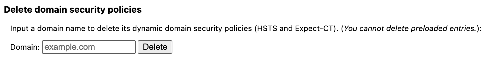

젠킨스를 도커 컨테이너로 실행 후 사이트가 제대로 뜨지 않아  
어떻게 해결해야할지 모르고 있었던 중
임시?적인 해결법을 찾았다.

### 에러

`‘This site can’t provide a secure connection’ or ‘ERR_SSL_PROTOCOL_ERROR.’`

### 해결방법

아래의 주소로 접속

```
chrome://net-internals/#hsts
```

그리고 본인의 도메인을 입력


[출처](https://velog.io/@lluna/deploy-chrome)
