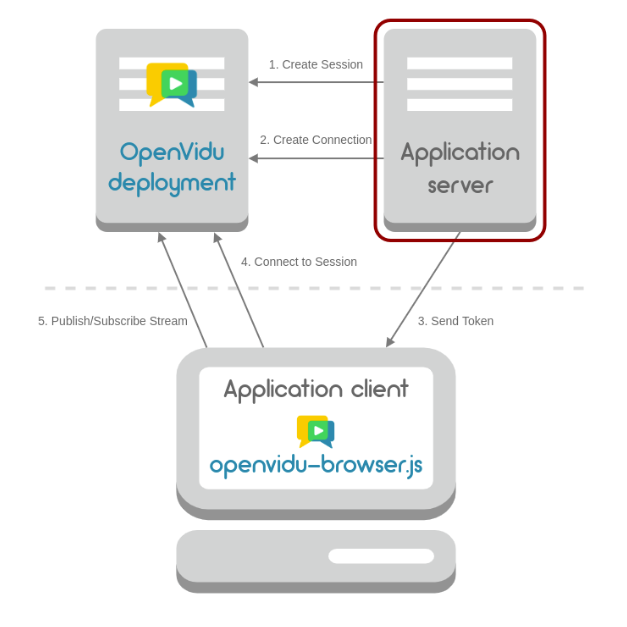

## 개요

SSAFY 2학기에 접어들면서 저 포함 6명의
팀원이 함께 공통프로젝트를 진행하게 되었습니다.

공통프로젝트는 WebRTC를 이용한 프로젝트를 진행하게 되는데 제 개인  
클라우드 서버(오라클)과 SSAFY에서 지급한 EC2(AWS)에 WebRTC를  
간편하게 사용할 수 있게 해주는 openvidu 서버를 구축해보면서  
경험한 여러 삽질과 제가 이해한 내용에 대해 정리해보려 합니다.

## WebRTC(Web Real-Time Communication)란

- 웹 브라우저가 서로 통신할 수 있도록 설계된 API
- 웹 브라우저 상에서는 어떠한 플러그인도 필요 없이 음성 채팅과 화상 채팅,
  데이터 교환까지도 가능하게 하는 기술
- WebRTC 기술은 **P2P(Peer-to-Peer)** 통신에 최적화

## Signaling

- RTCPeerConnection들이 적절하게 데이터를 교환할 수 있게 처리해주는 과정
- 이를 수행하는 서버 = **시그널 서버**
- 전이중 통신을 지원하는 **websocket**으로 이를 구현하는 것이 가장 적합
- `세션제어메세지`, `네트워크 구성`, `미디어 기능` 정보 교환
- 시그널링은 P2P 스트리밍 시작 전에 성공적으로 완료되어야 함
  - **세션 제어 메세지** : 통신을 초기화하거나 닫고 오류를 보고
  - **네트워크 구성** : 외부세계에 컴퓨터의 ip주소와 포트가 무엇인지 파악
  - **미디어 기능** : 브라우저와 통신하려는 브라우저에서 처리할 수 있는 코덱과 해상도를 파악

## 서버

- 서버는 단지 웹 브라우저를 특정하기 위한 **시그널링 과정으로만 쓰임**
- 시그널링을 마친 뒤 실제 데이터는 P2P 혹은 중개 서버를 통해 주고 받음
- 서버에서는 websocket(TCP) 사용 (WebRTC는 UDP)

## Openvidu란

- 웹 또는 모바일 애플리케이션에서 화상 통화를 쉽게 추가할 수 있는 오픈소스 플랫폼
- Kurento기반의 중개 서버를 애플리케이션에 쉽게 추가할 수 있도록 완전한 기술스택을 제공
- Kurento : WebRTC 미디어 서버 역할을 함과 동시에 WebRTC 기술을 이용해 애플리케이션 개발을 돕는 클라이언트 API세트
  - 그룹간의 통신, 녹음, 방송, 시청각 흐름의 라우팅 기술을 지원하고 있다.
- WebRTC 미디어 서버를 구현하는 데 소모되는 리소스를 절약해서 빠르게 실시간 통신을 추가할 수 있도록 도와주는 것이 큰 장점이다.

## Openvidu의 구조 (미작성)


<br>
<br>
openvidu의 대략적인 구조는 다음과 같습니다.

- Application client
  - 사용자와 직접 상호 작용하는 코드이며 openvidu의 프론트엔드 구현체를 사용할 수 있는 부분입니다.
- Application server
  - Application client로부터 api 요청을 받아 처리해주고 deployment와 연결해주는 부분입니다.
  - 본인이 작성한 백엔드 서버가 담당하는 부분입니다.
- Openvidu deployment
  - Kurento 미디어 서버, turn 서버 등 openvidu가 추상화한 기능들을 제공하는 구현체입니다.

## 단계

1. 클라우드 서버의 포트 열기
2. 온프레미스 환경 구축에 대한 공식 문서와 똑같이 진행
   - 도커 설치
   - openvidu deployment 관련 파일 다운로드
   - openvidu start를 통해 docker-compose 실행 -> 컨테이너들 실행
3. 어플리케이션을 직접 커스텀한 부분으로 수정

- docker-compose.override.yml 파일을 수정해서 사용

## 원했던 환경

제가 구축하고 싶었던 개발 환경은 프론트 팀원이 개발하면서 바로 테스트 할 수 있게  
ec2에 자바 어플리케이션 서버와 openvidu deployment를 배포하는 것이었습니다.

## 해야할 것들

기본으로 제공하는 코드의 포트 번호들은 따로 수정할 필요 없으며  
openvidu docker-compose가 실행되면서 nginx등의 작업들도 모두 처리해줍니다.
저는 이 부분을 잘못 이해해서 많은 시간을 소요했습니다.

## 삽질한 부분

또한 제 컴퓨터의 크롬 브라우저는 성공적으로 서버 접속이 되는데, 다른 브라우저와
팀원들의 컴퓨터는 접속할 수 없는 문제가 있었습니다  
이 문제는 .env 파일에서 ssl 관련 인증을 letsencrypt로 수정하면서 해결되었습니다.  
공식 문서에서 서로 다른 하드웨어에 서비스들을 각각 구축할 경우, 프록시 서버를 통해 통신해야한다고 이야기 했지만  
제 크롬 브라우저에서는 성공적으로 접속한 점과 openvidu 컨테이너에서 이미 nginx를 사용하는데, 내가 어떻게 건들 수 있나? 라는 생각 때문에 많은 삽질과 시간을 버렸습니다...  
우선 제 브라우저가 이상해서 접속이 되었던 것이고, openvidu deployment에서 nginx 컨테이너도 포함되어있기에 .env파일을 수정하는 것만으로 ssl 인증서 발급과 https 프록시 서버까지 해결해줍니다.  
편하게 사용하시면 됩니다.

기본적으로 ./openvidu start 명령어는 docker compose 명령어를 실행하는 것이기에  
docker에 대해서 잘 모르시는 분들은 공부를 해보시고 구축하시면 도움이 많이 될것입니다.

처음 글을 작성할 때는 대단한 것을 발견한 것처럼 썼는데 docker compose가 어떻게 구성되는지 알고 나서는  
너무 당연한 내용들이네요

## Reference

[openvidu 개념1](https://velog.io/@ohsg97/openVidu-tutorial-%EC%8B%9C%EC%9E%91%ED%95%98%EA%B8%B0)  
[openvidu 개념2](https://2jinishappy.tistory.com/335)  
[openvidu 공식 문서-자바 어플리케이션 서버](https://docs.openvidu.io/en/stable/application-server/openvidu-basic-java/)  
[openvidu 공식 문서-온프레미스로 배포하기](https://docs.openvidu.io/en/stable/deployment/ce/on-premises/)  
[openvidu 공식 문서-openvidu 어플리케이션 배포관련](https://docs.openvidu.io/en/stable/deployment/deploying-openvidu-apps/#with-docker)  
[openvidu 공식 문서-openvidu 리액트 클라이언트 예제](https://docs.openvidu.io/en/stable/tutorials/openvidu-react/)  
[openvidu 배포 관련 게시글](https://hoonti06.gitlab.io/wiki/deploying-openvidu-on-premises/#openvidu%EB%A5%BC-%EC%82%AC%EC%9A%A9%ED%95%98%EB%8A%94-application%EC%9D%84-openvidu%EA%B0%80-%EB%B0%B0%ED%8F%AC%EB%90%98%EB%8A%94-%EC%84%9C%EB%B2%84%EC%97%90-%EA%B0%99%EC%9D%B4-%EB%B0%B0%ED%8F%AC%ED%95%98%EB%8A%94-%EB%B0%A9%EB%B2%95)
[싸피 선배님의 조언-포트관련](https://velog.io/@kwak0568/OpenVidu-%EB%B0%B0%ED%8F%AC-Port%EC%99%80%EC%9D%98-%EC%A0%84%EC%9F%81)

```toc

```
